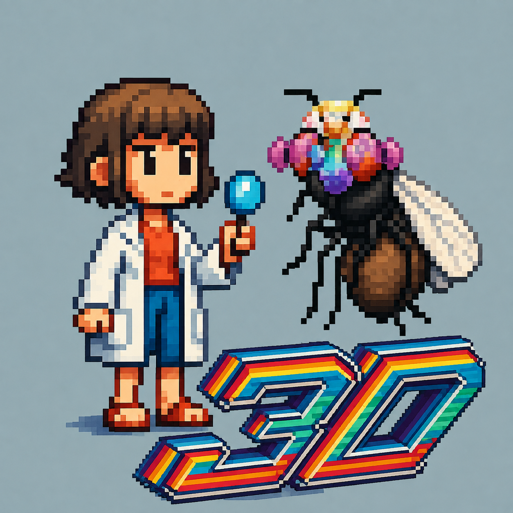
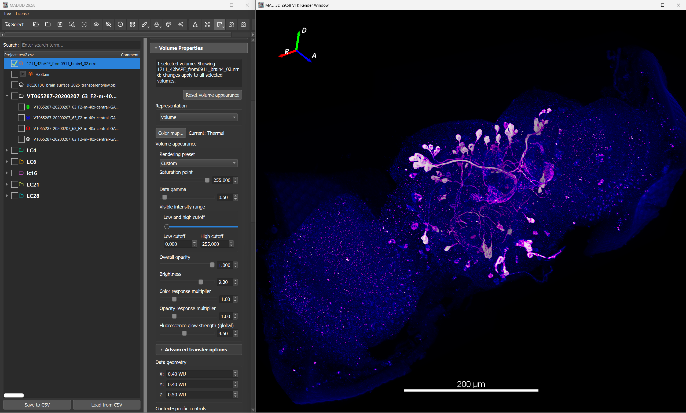
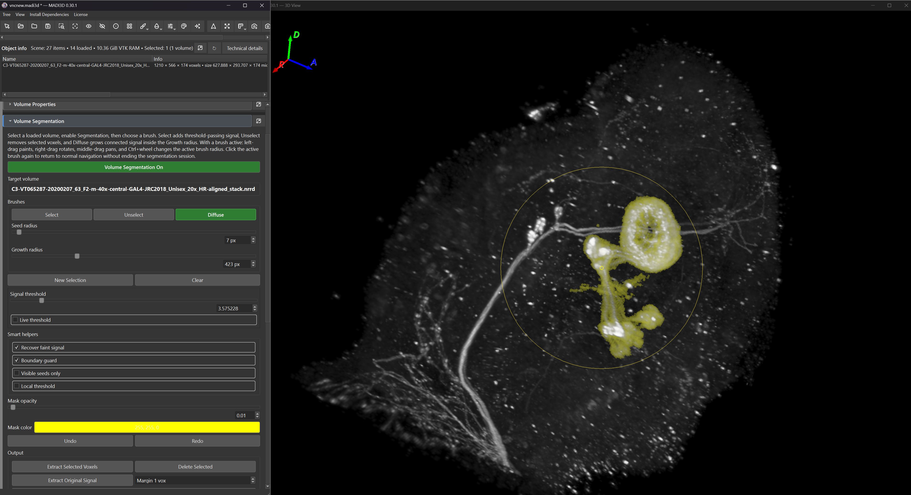
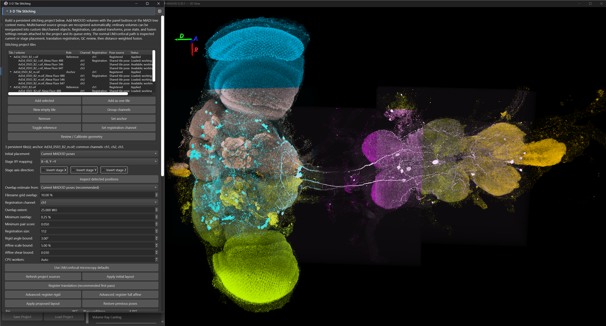
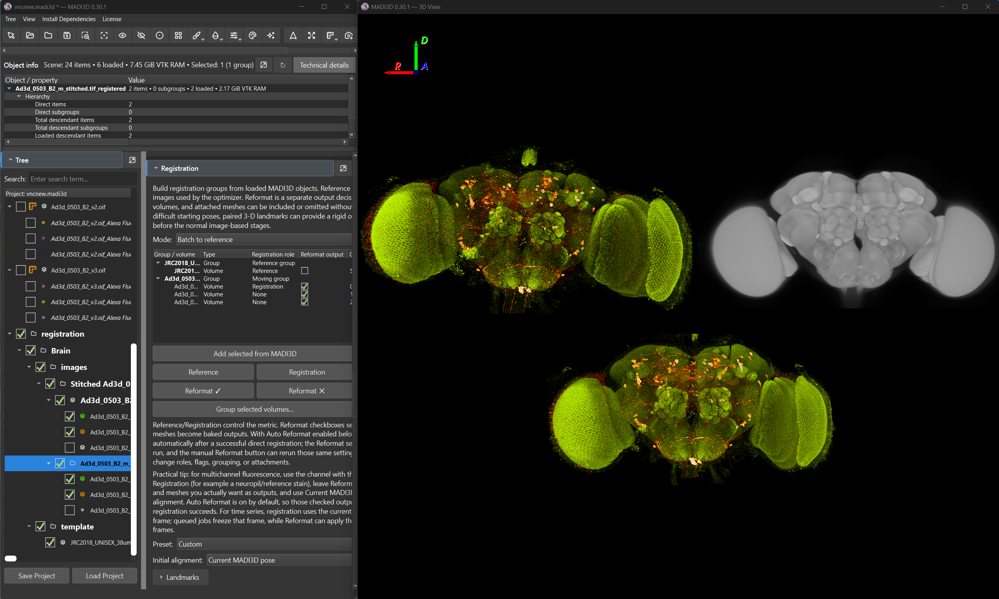
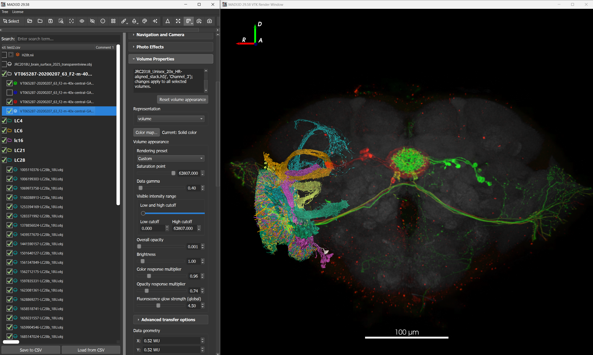

# MADI3D

**Morphometric Anatomical Data Investigator in Stereographic 3D**

MADI3D is a cross-platform scientific 3D microscopy workbench for **visualization, segmentation, stitching, registration, time-series exploration, morphological comparison, and reproducible scientific figure preparation**.

Built with **VTK, PySide6, and Qt 6**, MADI3D was developed primarily for neuroscience and fluorescence microscopy, with particular emphasis on high-quality volumetric rendering, neuromorphology, light-microscopy to electron-microscopy comparison, and interactive work with complex 3D datasets.

> **Public Beta** — MADI3D is under active scientific software development. Use the current release for research and evaluation, retain project provenance, and validate quantitative or biological conclusions for your workflow.

Pre-built packages are available for:

- **Windows x64**
- **Linux x64**
- **macOS Apple Silicon**
- **macOS Intel**

➡️ **[Download the latest MADI3D release](https://github.com/sandorbx/MADI3D/releases)**

## Install MADI3D

The four platform-specific MADI3D assets on the GitHub Releases page are the actual distributable archives. **Download the package for your platform and extract it exactly once.** There is no second MADI3D archive inside it. GitHub also generates separate `Source code` ZIP/TAR archives automatically; those are source snapshots, not runnable MADI3D packages.

### Windows x64

1. Download `MADI3D-Windows-x64.zip` from the latest release.
2. Extract the ZIP once to a normal writable folder.
3. Open the extracted `MADI3D` folder and run `MADI3D.exe`.
4. The public beta is not currently code-signed, so Windows SmartScreen may show a first-run warning. Continue only when the file came from the official MADI3D release and its checksum matches `SHA256SUMS.txt`.

### Ubuntu/Linux x64

1. Download `MADI3D-Linux-x64.tar.gz`.
2. Extract the archive once.
3. Run `MADI3D/MADI3D` from the extracted folder.
4. Optional: move the extracted `MADI3D` folder to its permanent location first, then run `MADI3D/install-launcher.sh` to add the desktop launcher for the current user.

### macOS Apple Silicon

1. Download `MADI3D-macOS-arm64.zip`.
2. Extract the ZIP once.
3. Move `MADI3D.app` to Applications if desired, then open it.
4. The public beta is not currently Apple-notarized or code-signed. If Gatekeeper blocks the first launch, use macOS's standard user-approved Open / Privacy & Security override only after verifying that the package came from the official release and matches `SHA256SUMS.txt`.

### macOS Intel

Follow the same macOS procedure using `MADI3D-macOS-x64.zip`.

Packaged releases are self-contained and do not require a separate Python environment. `SHA256SUMS.txt` on each release can be used to verify the downloaded archive before running it.

---

## What MADI3D can do

MADI3D brings a range of normally separate 3D imaging tasks into one workspace:

- fluorescence microscopy volume rendering
- 3D and 4D/time-series visualization
- Smart Brush volume segmentation
- Mesh Brush painting and segmentation
- tiled 3D microscopy stitching
- CMTK rigid, affine, and deformable registration
- landmark-assisted registration
- interactive transforms
- LM ↔ EM neuron comparison through NeuronBridge
- SWC and mesh visualization
- stereoscopic 3D inspection
- FreeFly navigation
- photographic rendering effects
- scientific figure preparation
- camera animation and video recording
- project organization and annotation

The aim is not merely to display 3D data, but to keep visualization, processing, comparison, and presentation within the same spatial context.

---

# 3D visualization

MADI3D can display microscopy volumes, neuronal reconstructions, meshes, surfaces, textured 3D objects, and time-series microscopy data together in the same interactive scene.

Features include:

- GPU-accelerated VTK volume rendering
- fluorescence microscopy transfer functions
- simultaneous volume, mesh, and SWC visualization
- stereoscopic 3D rendering
- interactive clipping
- adjustable colors and opacity
- camera and perspective controls
- photographic and presentation effects
- FreeFly navigation
- time-series playback
- camera animation
- MP4 recording

Fluorescence microscopy rendering follows principles similar to those described in:

> Wan et al., *FluoRender: an application of 2D image space methods for 3D and 4D confocal microscopy data visualization in neurobiology research*  
> https://bmcbioinformatics.biomedcentral.com/articles/10.1186/s12859-017-1694-9

---

# Smart Brush — 3D volume segmentation

MADI3D includes an interactive **Smart Brush** designed for segmentation directly on volumetric microscopy data.

Instead of working only slice-by-slice, the user can paint and erase signal while continuously rotating and examining the specimen in 3D.

The segmentation system includes:

- screen-space 3D painting
- Paint and Erase modes
- interactive brush-size control
- live signal thresholding
- connectivity-aware segmentation
- recovery of faint structures
- selection and extraction tools
- direct inspection of the segmented result in 3D

This is particularly useful for isolating neuronal signal from fluorescence microscopy volumes, where thin processes can be difficult to interpret from individual image slices.

Segmentation remains part of the actual 3D scene, making it possible to repeatedly rotate the specimen, inspect difficult structures, and refine the mask without moving between several applications.

---

# Mesh Brush — interactive mesh segmentation

MADI3D also includes a dedicated **Mesh Brush** for selecting, painting, editing, and segmenting surface geometry directly in the 3D renderer.

The Mesh Brush is intended for cases where the scientific object is already represented as a mesh rather than a voxel volume.

It supports interactive operations including:

- painting mesh regions directly in 3D
- erasing painted regions
- selecting mesh areas
- screen-space selection
- adjustable brush radius
- extraction of selected geometry
- deletion of selected regions
- resetting selections
- repeated inspection and refinement from different viewpoints

Screen-space interaction makes it possible to work on complicated surfaces without manually identifying individual vertices or polygons.

The mesh and volume segmentation systems are separate tools because the underlying data are fundamentally different: one modifies surface geometry, while the other operates on volumetric image signal.

This allows MADI3D to provide appropriate workflows for both forms of 3D biological data instead of forcing one segmentation model onto everything.

---

# 3D microscopy stitching

MADI3D includes a native workflow for assembling tiled 3D microscopy acquisitions.

This is particularly useful for high-resolution confocal imaging where the complete specimen cannot be acquired as a single field of view.

The stitching system supports:

- overlap detection
- phase-correlation-based alignment
- normalized cross-correlation
- global tile positioning
- translation-based stitching
- optional rigid and affine refinement
- multichannel acquisitions
- propagation of solved geometry between channels
- smooth fusion of overlapping image data
- editing and review of tile placement
- processing of multiple stitching jobs

Rather than simply aligning tiles sequentially, MADI3D can determine a globally consistent configuration from the relationships between overlapping volumes.

Solved tile geometry can also be applied consistently across related microscopy channels.

The global translation workflow follows the same core principles described in:

> Preibisch, Saalfeld & Tomancak, *Globally optimal stitching of tiled 3D microscopic image acquisitions*  
> https://doi.org/10.1093/bioinformatics/btp184

---

# CMTK registration

MADI3D provides an integrated **CMTK-based registration workflow** for aligning microscopy datasets to each other or to anatomical templates.

Registration tools include:

- rigid registration
- affine registration
- 9-DOF and 12-DOF models
- nonlinear B-spline registration
- configurable similarity metrics
- configurable optimization parameters
- microscopy-oriented presets
- deformable registration
- reformatting of registered data
- preservation and application of registration transforms

The registration workflow is suitable for applications such as aligning fluorescence microscopy specimens into standardized anatomical coordinate spaces.

CMTK and its affine/nonlinear registration workflow are described in:

> Rohlfing, *User Guide to The Computational Morphometry Toolkit*  
> https://doi.org/10.54294/ttdjo3
>
> Rohlfing & Maurer Jr., *Nonrigid image registration in shared-memory multiprocessor environments with application to brains, breasts, and bees*  
> https://doi.org/10.1109/TITB.2003.808506

---

## Landmark-assisted registration

Registration can also be guided by manually defined anatomical landmarks.

MADI3D provides tools for:

- creating corresponding landmark pairs
- displaying landmarks directly in the 3D scene
- interactively positioning landmarks
- adjusting landmark visibility and size
- using landmarks as part of the registration workflow

This allows automated intensity-based registration to be supplemented with explicit anatomical information when required.

Landmarks remain visible in the same 3D environment as the source and reference datasets, making incorrect correspondence easier to spot before a registration is run.

---

# Interactive transforms

The **Transform panel** provides direct control over object geometry.

It supports:

- translation
- rotation
- scaling
- linked XYZ scaling
- uniform scaling
- origin-based transforms
- center-based transforms
- interactive 3D manipulation

Transforms can be used for manual alignment, preparing datasets for registration, adjusting meshes and volumes, or positioning several objects for comparison.

The same scene can therefore contain raw data, manually positioned data, and results from more formal registration workflows.

---

# Time-series and 4D microscopy

MADI3D supports microscopy data containing a temporal dimension, allowing changing 3D volumes to be explored as a continuous dataset rather than as a collection of unrelated files.

Typical applications include:

- calcium imaging
- live fluorescence microscopy
- developmental imaging
- repeated volumetric acquisitions
- XYZ + time datasets

Time points can be explored while retaining the surrounding MADI3D scene, camera configuration, anatomical context, and rendering setup.

This makes it possible to move naturally between spatial and temporal inspection.

A time series can therefore be investigated as what it actually is: **a changing 3D object**, rather than a folder containing several dozen vaguely related stacks.

---

# FreeFly navigation

For complex 3D datasets, MADI3D includes a **FreeFly navigation mode**.

Conventional 3D viewers generally rotate the camera around a fixed target. FreeFly instead allows the camera itself to move through the scene.

This is useful for:

- navigating dense neuronal datasets
- travelling through large microscopy volumes
- examining structures from inside a reconstruction
- following long neuronal projections
- moving between distant structures
- understanding spatial relationships in complex scenes
- exploring data stereoscopically

FreeFly complements conventional trackball-style navigation and is particularly effective for scenes where simply orbiting around the entire dataset becomes awkward.

---

# Photographic effects and presentation rendering

Scientific visualization and figure preparation often require different rendering priorities.

MADI3D therefore includes **photographic and presentation effects** that allow a scientific scene to be refined for figures, presentations, and demonstrations without exporting the geometry into a separate rendering application.

These can be combined with:

- fluorescence rendering
- surface materials
- lighting
- object colors
- opacity
- clipping
- camera perspective
- background settings
- stereoscopic rendering
- depth and scene composition

The same project can therefore move from exploratory inspection to a polished scientific illustration while retaining the underlying 3D data and scene organization.

---

# Reproducible figure preparation with Save View

The **Save View** function is designed specifically for scientific figure preparation.

Saving a view does not simply create an image.

MADI3D saves the rendered image **together with the corresponding MADI3D view/state position**, allowing the scene used to produce that figure to be recovered later.

This is useful when:

- a figure needs to be regenerated
- rendering settings need to be changed after review
- colors or opacity need adjustment
- a higher-resolution version is required
- the exact camera position must be reused
- multiple figures need identical viewpoints
- a figure must be traced back to the scene from which it was created

A publication image therefore does not have to become an orphaned screenshot whose original viewpoint can never quite be found again.

The saved MADI3D state provides a route back to the scene configuration used to create it.

This is especially useful when preparing a series of related scientific figures where consistent camera positions and object arrangements matter.

---

# Animation and recording

MADI3D includes tools for producing animated views of 3D datasets.

The Animation and Recording panel can be used to:

- define camera movement
- animate scientific scenes
- generate rotating views
- inspect structures from changing viewpoints
- record MP4 video
- create material for presentations and publications

Animation can be combined with the same rendering, photographic, stereoscopic, and scene-organization tools used for normal interactive visualization.

---

# NeuronBridge and LM ↔ EM comparison

MADI3D integrates with **[NeuronBridge](https://neuronbridge.janelia.org/)** for light-microscopy to electron-microscopy neuron matching.

NeuronBridge Color MIP search results can be dragged into MADI3D, and associated LM and EM data can be retrieved automatically through the NeuronBridge API.

This allows a workflow such as:

**LM microscopy → registration → segmentation → morphology search → candidate retrieval → high-resolution 3D comparison**

Candidate neurons can then be inspected together with the original microscopy data instead of being evaluated solely from 2D projections.

This is particularly important for neuronal morphology, where two candidates that appear similar in projection may differ clearly when their complete arborization is examined in 3D.

MADI3D is therefore especially useful for the final verification stage of an LM ↔ EM matching workflow.

NeuronBridge, its morphology-search architecture, and its public APIs are described in:

> Clements et al., *NeuronBridge: an intuitive web application for neuronal morphology search across large data sets*  
> https://doi.org/10.1186/s12859-024-05732-7

---

# Working with meshes, SWCs and volumes together

One of MADI3D's main strengths is that different representations of biological structures can coexist in the same scene.

A project can contain, for example:

- fluorescence microscopy volumes
- segmented volumes
- OBJ meshes
- SWC neuron reconstructions
- anatomical surfaces
- EM reconstructions
- textured 3D scans

These can be organized, transformed, colored, clipped, hidden, compared, and annotated independently or together.

This is useful for multimodal workflows where the scientifically interesting relationship is between several kinds of data rather than within one file format.

---

# Data organization and projects

The project tree is designed for working with collections of scientific data rather than isolated files.

Objects can be:

- arranged into groups and subgroups
- reordered
- selected individually or together
- shown or hidden
- annotated
- transformed
- processed through context-sensitive operations

Multiple selection uses familiar desktop controls:

- **Shift + click** — select a range
- **Ctrl/Cmd + click** — select multiple individual objects

Most object-specific functions are available through the **right-click context menu**.

Several free-form annotation fields are available for recording experimental, anatomical, or review information.

---

# Save and reload projects

MADI3D projects can be saved and reopened so that work can continue across sessions.

Saved project state can preserve information such as:

- scene organization
- object properties
- visibility
- rendering settings
- transforms
- annotations
- data relationships
- camera and view information
- processing state

Project information is stored in a human-readable form and can also be inspected or processed outside MADI3D when required.

The intention is for the MADI3D project to represent the scientific workspace, not merely the collection of files currently visible on screen.

---

# Permissive geometry and derived-volume lineage

MADI3D separates what a source reported from the numerical geometry needed to work with its pixels:

- A **source observation** preserves raw spacing, units, origin, direction, diagnostics, and missing fields without repair.
- A **verified physical grid** is a validated voxel-to-physical mapping with explicit units. Source state is `resolved` only when this claim is justified; `unresolved` and `inconsistent` remain explicit otherwise.
- A **working grid** is the exact finite lattice used by loading and operations. It retains usable source values and records every deterministic default or replacement. It is reproducible, but it is not automatically physical calibration.
- A **geometry revision** identifies the grid snapshot used by an operation. Later calibration creates immutable revision history and marks dependent results stale; it does not rewrite completed transforms, measurements, exports, or generated data.

Missing, unsupported, uncertain, or conflicting physical metadata therefore does not by itself prevent a safe volume from being loaded, added, transformed, registered, stitched, fused, resampled, exported, or saved. MADI3D records warnings, assumptions, unit conversions, working transforms, and geometry revisions with the result. It still refuses ambiguous axes or series that would change pixel meaning, unreadable arrays, invalid MADI3D-owned geometry, singular or non-finite transforms, model/runtime disagreement, unsafe resource use, cancellation, and incomplete publication.

**Calibrate Physical Grid…** replaces uncertainty with an explicit acquisition-wide physical mapping. Each calibration records its correction source and note, prior and current grids, affected channels, timestamp, software version, and stable checksums. Completed work retains its captured geometry and receives a practical rerun recommendation when stale.

Physical calibration, scene transforms, and registration remain distinct:

- **Physical calibration** defines how voxel indices map to physical coordinates inside an acquisition.
- A **scene transform** positions an acquisition in the project without repairing its source evidence.
- **Registration** estimates a mapping between captured working grids. Differing source-space identities or absent units produce recorded warnings or assumptions, not an automatic execution block.

The scale bar has three honest contexts: verified physical units, an explicitly user-selected but unverified scene unit, or voxel/index units. Different source-space IDs alone do not hide a valid physical scale. Unsupported or mixed physical units cannot be presented as verified.

Generated masks, selected-voxel extractions, deleted-selection outputs, and original-signal extractions are typed derived acquisitions. Each retains stable identities, exact parent and parent-geometry snapshots, source frame, operation parameters, software version, checksums, observations, working geometry, warnings, assumptions, and crop/index relationships. Derived-from-derived results extend this lineage chain; names and filenames remain display metadata rather than scientific identity.

---

# Supported data

MADI3D supports common microscopy and morphology formats including:

- **TIFF / TIF**
- **Zeiss LSM**
- **Olympus OIF / OIB**
- **NRRD**
- **NIfTI / NII**
- **H5J**
- **OBJ**
- **SWC**
- **ZIP** packages containing textured 3D scans

Individual files, multiple files, and complete folders can be dragged directly into the render window or project tree.

Multichannel and time-series microscopy data are also supported in relevant workflows.

---

# Quick start

## 1. Download MADI3D

Go to the **[Releases](https://github.com/sandorbx/MADI3D/releases)** page and download the package for your operating system.

Extract the archive and start MADI3D. See **Install MADI3D** above for the exact package name and platform-specific first-run instructions.

Packaged releases do not require a separate Python development environment.

---

## 2. Load data

Drag files or folders directly into:

- the 3D render window, or
- the project tree on the left side of the interface.

You can load individual files, multiple files, or complete folders.

---

## 3. Organize your scene

Create groups and subgroups in the project tree.

Use checkmarks to control loading and visibility.

Most operations are available through the right-click menu for the selected object or objects.

---

## 4. Adjust volume visualization

Select a volume and use the Volume Properties controls to adjust its appearance.

Controls include transfer-function and threshold tools designed for fluorescence microscopy data.

---

## 5. Segment data

For microscopy volumes, use the **Smart Brush**.

For surface data, use the **Mesh Brush**.

The two tools provide dedicated workflows appropriate to their respective data types.

---

## 6. Stitch tiled microscopy

Select overlapping 3D microscopy tiles and use the Stitching workflow to estimate their relative positions and produce a fused volume.

Multichannel datasets can retain consistent tile geometry across channels.

---

## 7. Register data

Use the Registration panel for rigid, affine, or deformable registration.

Landmarks can be added where anatomical guidance is useful.

Registered transforms can subsequently be used to reformat related data.

---

## 8. Explore

Use the standard camera controls, clipping tools, stereoscopic rendering, or **FreeFly** to inspect the dataset.

For time-series data, navigate through time while preserving the surrounding 3D scene.

---

## 9. Prepare figures

Configure:

- camera position
- photographic effects
- lighting
- colors
- opacity
- clipping
- rendering properties

Then use **Save View** to save the figure together with the corresponding MADI3D state/view position.

---

## 10. Save your project

Save the project to retain your organization, properties, annotations, transforms, and processing state for later work.

---

# Typical applications

MADI3D was developed primarily around biological imaging and neuromorphology, but its tools can be used for a wider range of 3D scientific data.

Typical applications include:

- fluorescence microscopy visualization
- Drosophila neuroanatomy
- neuromorphology
- LM ↔ EM neuron matching
- anatomical template registration
- landmark-assisted registration
- confocal tile stitching
- volumetric neuron segmentation
- mesh segmentation
- neuronal reconstruction comparison
- calcium imaging
- 4D and time-series microscopy
- live imaging
- scientific figure preparation
- reproducible viewpoint capture
- scientific animation
- stereoscopic visualization
- organization and annotation of 3D datasets
- textured 3D scan visualization

---

# Interface

---

# Development philosophy

MADI3D is under active development.

Its central goal is to combine interactive 3D visualization with scientifically meaningful image-processing workflows without losing track of the geometry and state of the underlying data.

Physical coordinates, transforms, object relationships, processing state, and scientific data should remain explicit rather than being reconstructed from what happens to be visible in the renderer.

Scientific operations should be reproducible and testable, while visualization should remain interactive enough for practical exploratory work.

The result is intended to occupy the useful territory between a scientific image-processing application and a high-quality 3D visualization environment.

Bug reports, reproducible test cases, scientific workflow feedback, and contributions are welcome through the GitHub issue tracker.

---

# License

MADI3D uses a mixed licensing model.

The main application and source outside the explicitly open-source scientific
scope remain governed by the proprietary/freeware terms in the root
[`LICENSE`](LICENSE).

Selected project-owned scientific components for **registration, stitching,
volumetric segmentation, and volume rendering** are offered under
**GNU AGPL v3 only (`AGPL-3.0-only`)**. The exact source-path scope is defined
in [`OpenSource/README.md`](OpenSource/README.md), and the applicable license
text is provided in [`OpenSource/LICENSE`](OpenSource/LICENSE).

Third-party components retain their own licenses and notices under
[`LICENSES/`](LICENSES/).

---

# Contact

Project and release contact: **developer@madi3d.org**